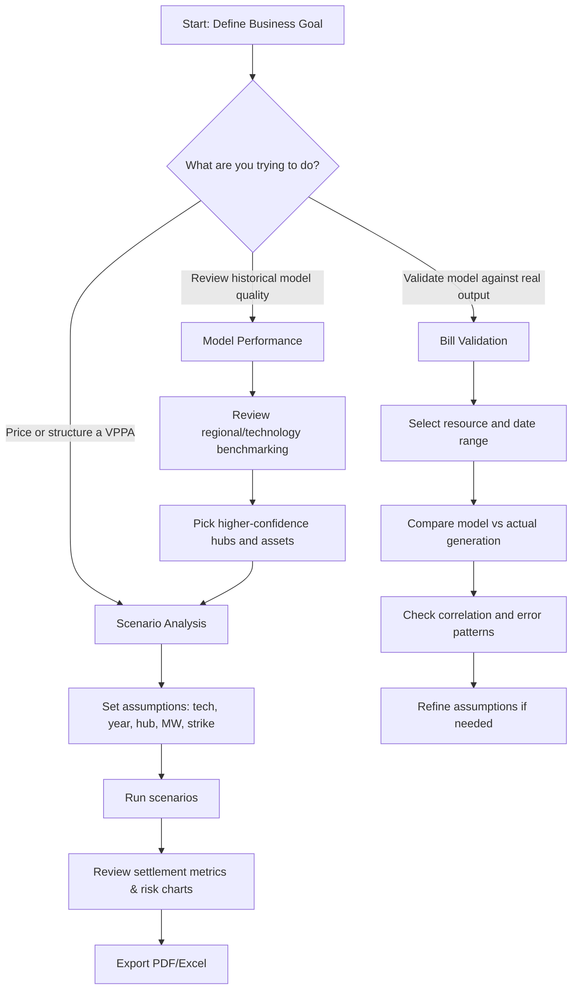

# User Guide: VPPA Settlement Estimator

This guide is for analysts, commercial teams, and project developers using the ERCOT VPPA Settlement Estimator.

## 1. Quick Start (5 Minutes)

1. Install dependencies:
   `pip install -r requirements.txt`
2. Start the app:
   `streamlit run app.py`
3. Open the app in your browser.
4. Review tabs in app order (left to right):
   - `Guide`
   - `Bill Validation`
   - `Scenario Analysis`
   - `Model Performance`
5. Go to `Scenario Analysis`.
6. In the sidebar, set:
   - Technology (`Solar` or `Wind`)
   - Year (2020-2026)
   - Location (Hub or custom map point)
   - Capacity (MW)
   - Strike Price ($/MWh)
7. Click `Run Scenarios`.
8. Review net settlement, monthly outcomes, and exports (PDF/Excel).

## 2. Which Tab Should I Use?

App tab order is:
`Guide` → `Bill Validation` → `Scenario Analysis` → `Model Performance`

| Tab (in app order) | Use it for | Main output |
|---|---|---|
| `Guide` | Onboarding and workflow reference | Setup instructions and process map |
| `Bill Validation` | Check model estimates against actual asset generation | Model-vs-actual validation metrics |
| `Scenario Analysis` | Build and compare deal cases | Financial comparison across scenarios |
| `Model Performance` | Understand fleet-wide model quality | Regional and technology benchmark views |

## 3. Standard User Workflows

### Workflow A: Bill Validation / QA (Tab 2)

1. Open `Bill Validation`.
2. Select a resource ID.
3. Set the date range.
4. Compare modeled profile vs ERCOT actual output.
5. Check correlation and bias before approving assumptions.

### Workflow B: New VPPA Screening (Tab 3)

1. Create 3-5 scenarios in `Scenario Analysis`.
2. Vary strike price, hub, and technology.
3. Review net settlement and downside months.
4. Export to PDF for stakeholder review.

### Workflow C: Location and Resource Confidence Check (Tab 4)

1. Open `Model Performance`.
2. Compare wind/solar performance by region.
3. Use highest-confidence regions to prioritize scenarios.

## 4. User Workflow Chart

## 5. Inputs and Outputs (At a Glance)

| Category | Key Inputs | Typical Outputs |
|---|---|---|
| Scenario setup | Tech, hub/location, strike, capacity, year | Net settlement, paid/received totals |
| Validation | Resource ID, date range | Correlation, profile comparison charts |
| Reporting | Scenario set and selected view | PDF settlement bill, Excel export |

## 6. Common Mistakes to Avoid

- Using the wrong hub for the asset location.
- Comparing scenarios with different capacities when you only intended to test strike sensitivity.
- Interpreting short date windows as full-year performance.
- Skipping bill validation before presenting model-driven recommendations.

## 7. Troubleshooting

- App does not start:
  - Reinstall dependencies with `pip install -r requirements.txt`.
- Charts look empty:
  - Confirm date range and scenario settings are valid.
- Slow first run:
  - Initial weather/data fetch and cache build can take longer than later runs.
