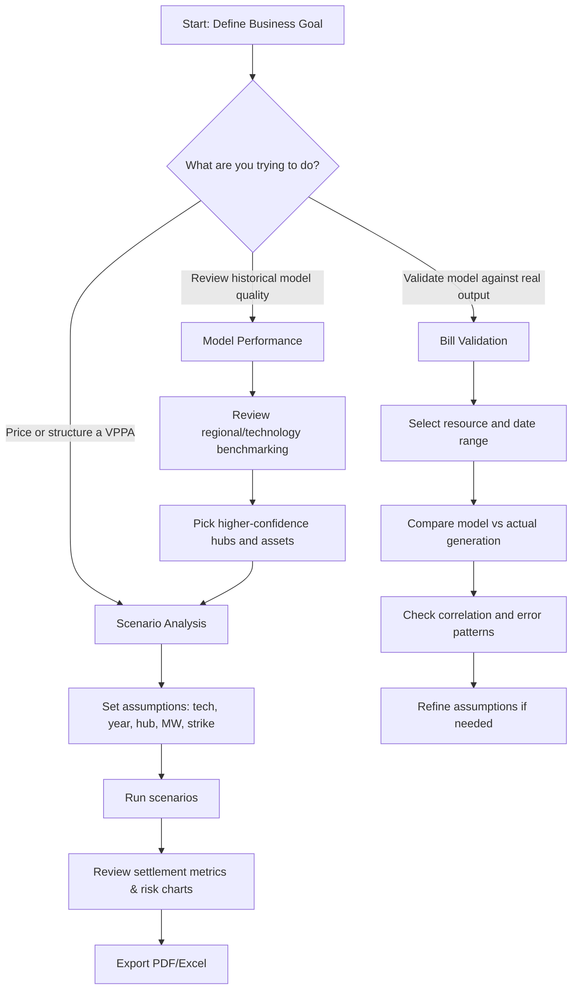

# User Guide: VPPA Settlement Estimator

This guide is for analysts, commercial teams, and project developers using the ERCOT VPPA Settlement Estimator.

## 1. Quick Start (5 Minutes)

1. Install dependencies:
   `pip install -r requirements.txt`
2. Start the app:
   `streamlit run app.py`
3. Open the app in your browser.
4. Review tabs in app order (left to right):
   - `Guide`
   - `Bill Validation`
   - `Scenario Analysis`
   - `Model Performance`
5. Read `Decision Story` below for decision context.
6. Go to `Scenario Analysis`.
7. In the sidebar, set:
   - Technology (`Solar` or `Wind`)
   - Year (2020-2026)
   - Location (Hub or custom map point)
   - Capacity (MW)
   - Strike Price ($/MWh)
8. Click `Run Scenarios`.
9. Review net settlement, monthly outcomes, and exports (PDF/Excel).

## 2. Decision Story (So What)

### What decision this app supports

Use this tool to decide whether a VPPA structure is commercially attractive and defensible before execution.

Typical decisions:
- Which technology and hub to shortlist for a deal.
- Which strike-price range is acceptable given downside risk.
- Whether modeled generation assumptions are credible enough for internal or external approval.

### Inputs that matter most

1. `Hub/Location`: Biggest driver of basis and weather profile behavior.
2. `Strike Price ($/MWh)`: Directly drives settlement transfer magnitude.
3. `Technology (Solar/Wind)`: Changes profile shape, seasonality, and capture dynamics.
4. `Year / Weather Case`: Determines market regime and weather sensitivity.
5. `Curtailment + Revenue Share assumptions`: Can materially change downside and upside asymmetry.

### Outputs to trust most

Highest confidence:
- Bill Validation correlation/error metrics for assets with strong overlap and data quality.
- Relative ranking across scenarios when only one variable is changed at a time.

Use with caution:
- Absolute dollar outcomes when assumptions differ in multiple dimensions at once.
- Short-window comparisons (single month) used as annual proxies.

Sanity checks before presenting:
1. Validate at least one comparable asset in `Bill Validation`.
2. Show sensitivity around strike (for example low/base/high).
3. Confirm outputs are consistent across at least two years or weather cases.

## 3. Which Tab Should I Use?

App tab order is:
`Guide` → `Bill Validation` → `Scenario Analysis` → `Model Performance`

| Tab (in app order) | Use it for | Main output |
|---|---|---|
| `Guide` | Onboarding, context, and workflow reference | Setup instructions and decision framework |
| `Bill Validation` | Check model estimates against actual asset generation | Model-vs-actual validation metrics |
| `Scenario Analysis` | Build and compare deal cases | Financial comparison across scenarios |
| `Model Performance` | Understand fleet-wide model quality | Regional and technology benchmark views |

## 4. Standard User Workflows

### Workflow A: Bill Validation / QA (Tab 3)

1. Open `Bill Validation`.
2. Select a resource ID.
3. Set the date range.
4. Compare modeled profile vs ERCOT actual output.
5. Check correlation and bias before approving assumptions.

### Workflow B: New VPPA Screening (Tab 4)

1. Create 3-5 scenarios in `Scenario Analysis`.
2. Vary strike price, hub, and technology.
3. Review net settlement and downside months.
4. Export to PDF for stakeholder review.

### Workflow C: Location and Resource Confidence Check (Tab 5)

1. Open `Model Performance`.
2. Compare wind/solar performance by region.
3. Use highest-confidence regions to prioritize scenarios.

## 5. User Workflow Chart

## 6. Inputs and Outputs (At a Glance)

| Category | Key Inputs | Typical Outputs |
|---|---|---|
| Scenario setup | Tech, hub/location, strike, capacity, year | Net settlement, paid/received totals |
| Validation | Resource ID, date range | Correlation, profile comparison charts |
| Reporting | Scenario set and selected view | PDF settlement bill, Excel export |

## 7. Monte Carlo Simulation (Beta)

### Purpose
Generate probabilistic outcomes by random sampling from historical weather (2005-2024) and price (2020-2026) data to understand the distribution of potential returns.

### How it Works
For each iteration (default 1000), the model:
1. Randomly selects a historical weather year (e.g., 2014).
2. Randomly selects a historical price year (e.g., 2022).
3. Calculates the VPPA settlement for that combination.
4. Aggregates results to show P10 (conservative), P50 (median), and P90 (optimistic) outcomes.

### Usage
1. Define your scenarios in the **Scenario Analysis** tab.
2. Scroll down to the **Monte Carlo Simulation (Optional)** expander.
3. Check **Enable Probabilistic Analysis**.
4. Set the **Number of Iterations** (100 - 10,000).
5. Click **Run Monte Carlo Analysis**.

### Interpretation
- **P50**: The median outcome; 50% of simulations were better, 50% were worse.
- **P10**: A conservative estimate; 90% of simulations were better than this.
- **P90**: An optimistic estimate; only 10% of simulations exceeded this.

## 8. Common Mistakes to Avoid

- Using the wrong hub for the asset location.
- Comparing scenarios with different capacities when you only intended to test strike sensitivity.
- Interpreting short date windows as full-year performance.
- Skipping bill validation before presenting model-driven recommendations.

## 9. Troubleshooting

- App does not start:
  - Reinstall dependencies with `pip install -r requirements.txt`.
- Charts look empty:
  - Confirm date range and scenario settings are valid.
## 10. Data Sources

| Data Type | Source | Link | Description |
|---|---|---|---|
| **Market Prices** | **GridStatus** | [gridstatus.io](https://www.gridstatus.io/) | Real-time ERCOT LZ/Hub prices (2020–2026).   *Note: 2026 data is YTD.* |
| **Solar/Wind Weather (2024+)** | **Open-Meteo** | [open-meteo.com](https://open-meteo.com/) | ERA5 Reanalysis for GHI and 10m/80m Wind Speed. Used for high-fidelity recent simulation. |
| **Historical Weather (2005-2023)** | **PVGIS** | [re.jrc.ec.europa.eu/pvgis](https://re.jrc.ec.europa.eu/pvgis/) | Long-term satellite data for historical backtesting and TMY profiles. |
| **Asset Metadata** | **ERCOT** | [ercot.com](https://www.ercot.com/gridinfo/generation) | Resource Integration and Efficiency (RIER) reports for facility details. |
| **Actual Gen Performance** | **ERCOT SCED** | [ercot.com](https://www.ercot.com/mktinfo/rtm) | 60-day delayed unit-level generation for model validation. |
