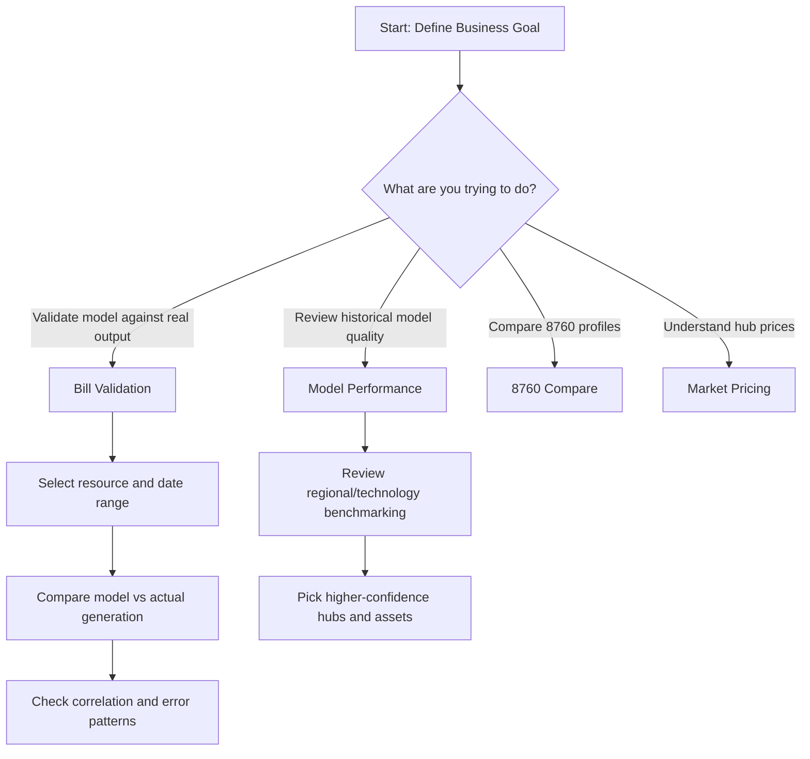

# User Guide: VPPA Settlement Estimator

This guide is for analysts, commercial teams, and project developers using the ERCOT VPPA Settlement Estimator.

## 1. Quick Start (5 Minutes)

1. Install dependencies:
   `pip install -r requirements.txt`
2. Start the app:
   `streamlit run app.py`
3. Open the app in your browser.
4. Review tabs in app order (left to right):
   - `Guide`
   - `Bill Validation`
   - `Model Performance`
   - `8760 Compare`
   - `Market Pricing`
5. Go to `Bill Validation`.
6. Select a resource ID and date range to compare the modeled profile against ERCOT actual output.
7. Check correlation and bias before approving assumptions.

## 2. Decision Story (So What)

### What decision this app supports

Use this tool to validate modeled assumptions against actual performance.
Typical decisions:
- Whether modeled generation assumptions are credible enough for internal or external approval.
- Which technology and hub to shortlist based on historical model accuracy.

### Outputs to trust most

Highest confidence:
- Bill Validation correlation/error metrics for assets with strong overlap and data quality.
- Relative ranking across regions when using the `Model Performance` benchmark views.

Use with caution:
- Short-window comparisons (single month) used as annual proxies.

Sanity checks before presenting:
1. Validate at least one comparable asset in `Bill Validation`.
2. Confirm outputs are consistent across at least two years or weather cases.

## 3. Which Tab Should I Use?

| Tab | Use it for | Main output |
|---|---|---|
| `Guide` | Onboarding, context, and workflow reference | Setup instructions and decision framework |
| `Bill Validation` | Check model estimates against actual asset generation | Model-vs-actual validation metrics |
| `Model Performance` | Understand fleet-wide model quality | Regional and technology benchmark views |
| `8760 Compare` | Compare 8760 profiles side by side | Net generation profiles and value |
| `Market Pricing` | Inspect ERCOT price level, volatility, and negative-price exposure | Trend, distribution, and monthly price views |

## 4. Standard User Workflows

### Workflow A: Bill Validation / QA

1. Open `Bill Validation`.
2. Select a resource ID.
3. Set the date range.
4. Compare modeled profile vs ERCOT actual output.
5. Check correlation and bias before approving assumptions.

### Workflow B: Location and Resource Confidence Check

1. Open `Model Performance`.
2. Compare wind/solar performance by region.
3. Use highest-confidence regions to prioritize locations.

## 5. User Workflow Chart

```mermaid
flowchart TD
    A["Start: Define Business Goal"] --> B{"What are you trying to do?"}
    B -->|"Validate model against real output"| D["Bill Validation"]
    B -->|"Review historical model quality"| E["Model Performance"]
    B -->|"Compare 8760 profiles"| F["8760 Compare"]
    B -->|"Understand hub prices"| G["Market Pricing"]

    D --> J["Select resource and date range"]
    J --> K["Compare model vs actual generation"]
    K --> L["Check correlation and error patterns"]

    E --> N["Review regional/technology benchmarking"]
    N --> O["Pick higher-confidence hubs and assets"]
```

## 6. Common Mistakes to Avoid

- Using the wrong hub for the asset location.
- Interpreting short date windows as full-year performance.
- Skipping bill validation before presenting model-driven recommendations.

## 7. Troubleshooting

- App does not start:
  - Reinstall dependencies with `pip install -r requirements.txt`.
- Charts look empty:
  - Confirm date range and settings are valid.

## 8. Data Sources

| Data Type | Source | Link | Description |
|---|---|---|---|
| **Market Prices** | **GridStatus** | [gridstatus.io](https://www.gridstatus.io/) | Real-time ERCOT LZ/Hub prices (2020–2026).   *Note: 2026 data is YTD.* |
| **Solar/Wind Weather (2024+)** | **Open-Meteo** | [open-meteo.com](https://open-meteo.com/) | ERA5 Reanalysis for GHI and 10m/80m Wind Speed. Used for high-fidelity recent simulation. |
| **Historical Weather (2005-2023)** | **PVGIS** | [re.jrc.ec.europa.eu/pvgis](https://re.jrc.ec.europa.eu/pvgis/) | Long-term satellite data for historical backtesting and TMY profiles. |
| **Asset Metadata** | **ERCOT** | [Resource Integration](https://www.ercot.com/gridinfo/generation) | Resource Integration and Efficiency (RIER) / GIS Reports for facility details. |
| **Actual Gen Performance** | **ERCOT SCED** | [60-Day Disclosure](https://www.ercot.com/mktinfo/rtm) | 60-day delayed unit-level generation for model validation.   **Settlement Timeline:** Initial (T+10), Final (T+55), True-Up (T+180). |
